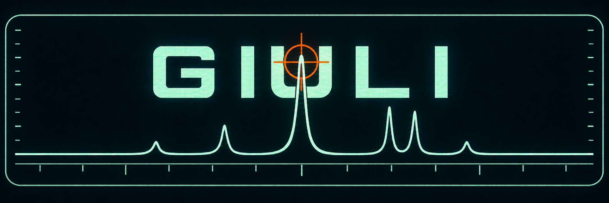

<p align="center">
  
</p>

<p align="center">
  <a href="https://doi.org/10.5281/zenodo.23147218">
    
  </a>
</p>

GIULI es un programa de código abierto para el procesamiento interactivo y
reproducible de espectros de RMN. Está orientado inicialmente a experimentos
Bruker 1D de protón y a flujos de trabajo de metabolómica.

Está dirigido a investigadores, estudiantes y laboratorios que necesiten
procesar, comparar, alinear, integrar y exportar conjuntos de espectros sin
depender de software propietario para todo el flujo de análisis.

Versión actual: **1.0.0**.

## Descargar para Windows

[Descargar el instalador de GIULI 1.0.0 para Windows (64 bits)](https://github.com/EXCI5ION/giuli-nmr/releases/download/v1.0.0/GIULI-1.0.0-windows-x64.exe)

También puedes consultar la [última versión publicada](https://github.com/EXCI5ION/giuli-nmr/releases/latest)
y sus notas de lanzamiento.

## Instalación desde el código fuente

GIULI requiere **Python 3.12**. Por el momento, Linux y macOS se distribuyen
mediante instalación desde el código fuente.

### Windows (Git Bash)

```bash
git clone https://github.com/EXCI5ION/giuli-nmr.git
cd giuli-nmr
py -3.12 -m venv .venv
source .venv/Scripts/activate
python -m pip install --upgrade pip
python -m pip install .
giuli
```

### Linux

```bash
git clone https://github.com/EXCI5ION/giuli-nmr.git
cd giuli-nmr
python3.12 -m venv .venv
source .venv/bin/activate
python -m pip install --upgrade pip
python -m pip install .
giuli
```

### macOS

```bash
git clone https://github.com/EXCI5ION/giuli-nmr.git
cd giuli-nmr
python3.12 -m venv .venv
source .venv/bin/activate
python -m pip install --upgrade pip
python -m pip install .
giuli
```

## Funcionalidades

En su versión actual, GIULI permite:

- Cargar conjuntos de datos Bruker 1D desde sus FID y procesarlos utilizando
  los parámetros compatibles almacenados en `procs`.
- Realizar correcciones de fase y línea de base, manuales y automáticas.
- Referenciar, visualizar, apilar y superponer espectros.
- Alinear conjuntos de forma global, automática o manual por regiones.
- Definir zonas ciegas y plantillas reutilizables de regiones.
- Normalizar por área total, pico máximo o PQN.
- Calcular integrales absolutas y relativas de conjuntos espectrales.
- Exportar matrices espectrales e integrales en formato CSV o texto tabulado.
- Guardar el trabajo en proyectos comprimidos con extensión `.giu`.

## Cómo citar

Los metadatos de citación de GIULI se encuentran en [`CITATION.cff`](CITATION.cff).
GitHub permite obtener desde ese archivo una referencia en formatos APA y BibTeX.
Para citar la versión 1.0.0 utiliza
[https://doi.org/10.5281/zenodo.23147219](https://doi.org/10.5281/zenodo.23147219).
El [DOI conceptual](https://doi.org/10.5281/zenodo.23147218) reúne todas las
versiones publicadas de GIULI.

## Licencia

Copyright (C) 2026 Gabriel Anderson.

GIULI es software libre distribuido bajo la
[GNU General Public License, versión 3](LICENSE) (`GPL-3.0-only`). Los componentes
de terceros conservan sus propias licencias; consulta
[`THIRD_PARTY_NOTICES.md`](THIRD_PARTY_NOTICES.md).
